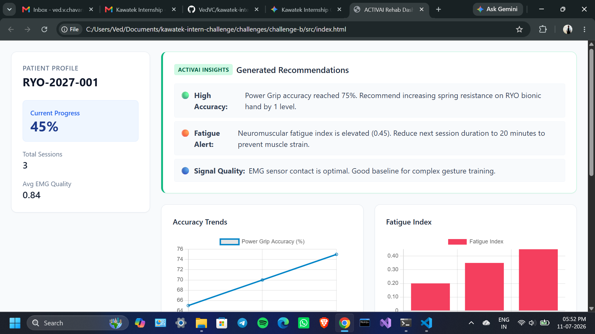
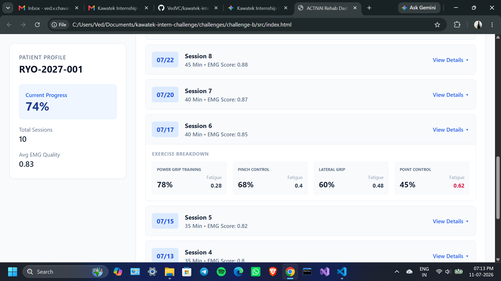

# Challenge B: Rehabilitation Dashboard Prototype

## Dashboard Preview

Running the Project

* Because this prototype is built with Vanilla HTML/JS, no build tools or local servers are required.

* Open the challenges/challenge-b/src folder.

* Double-click index.html to open it in any modern web browser.

## Technical Decisions & Problem Solving

* Zero-Dependency Architecture: I chose Vanilla HTML/CSS/JS. To eliminate CORS (Cross-Origin Resource Sharing) errors that occur when opening local HTML files that try to fetch local JSON files, I combined the full provided 10-session dataset and the JavaScript logic directly into a single index.html file. This guarantees a frictionless review experience for the evaluator.

* Styling: Used Tailwind CSS via CDN for rapid, responsive UI construction without managing external stylesheets.

* Visualization: Implemented Chart.js to map the dataset, filtering for "Power Grip Training" to maintain a clean trend line for accuracy and fatigue.

## UI/UX & Clinical Focus

I designed the interface prioritizing data hierarchy, interactivity, and clinical utility:

* At-a-Glance Metrics: Critical data (Current Progress, Total Sessions) is pinned in the sidebar for immediate context.

* Alert-Driven AI: The ACTIVAI insights section is styled similarly to medical alerts—placed at the top of the content hierarchy with color-coded severity indicators so therapists can immediately action the data.

* Interactive Session History: To satisfy the requirement for expandable details without cluttering the screen, I implemented a reverse-chronological accordion list. Therapists can scroll past the macro-level charts and click into specific sessions to investigate micro-level exercise metrics across the entire 10-session history.

## AI Recommendation Logic

The AI recommendation engine is simulated using a rule-based algorithm that parses the latest session data and triggers specific thresholds:

* Evaluates fatigue_index to protect patients from neuromuscular strain (e.g., > 0.4 triggers a monitor alert).

* Evaluates accuracy_percent to suggest progressive overload (e.g., > 85% suggests increasing resistance).

* Validates emg_quality_score to ensure sensor fidelity.
